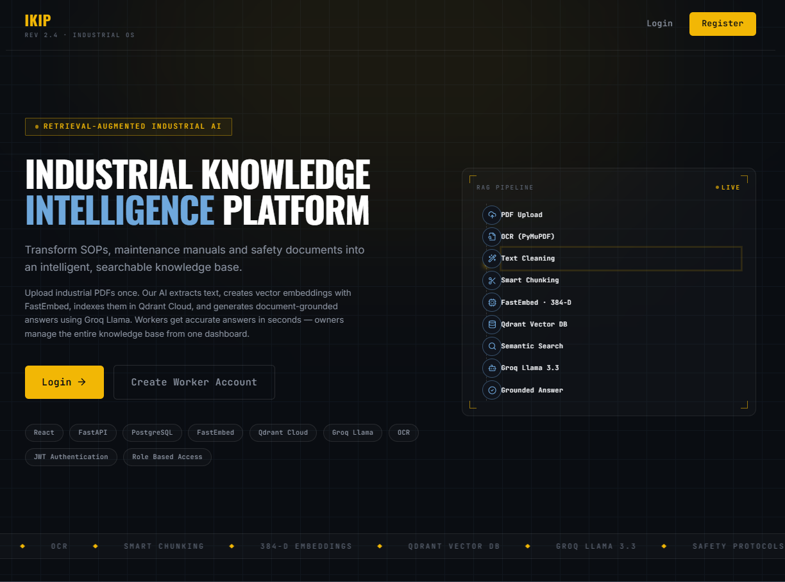
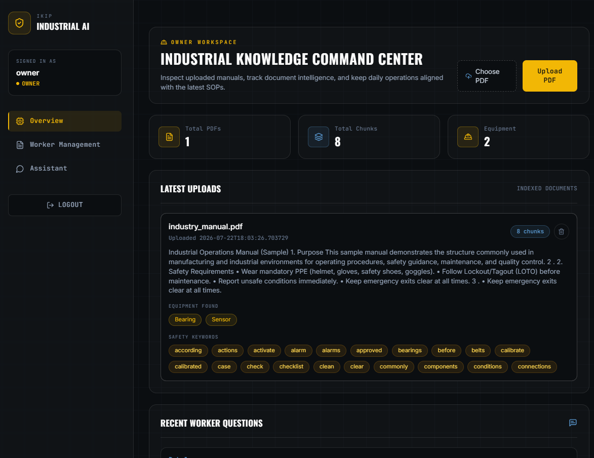
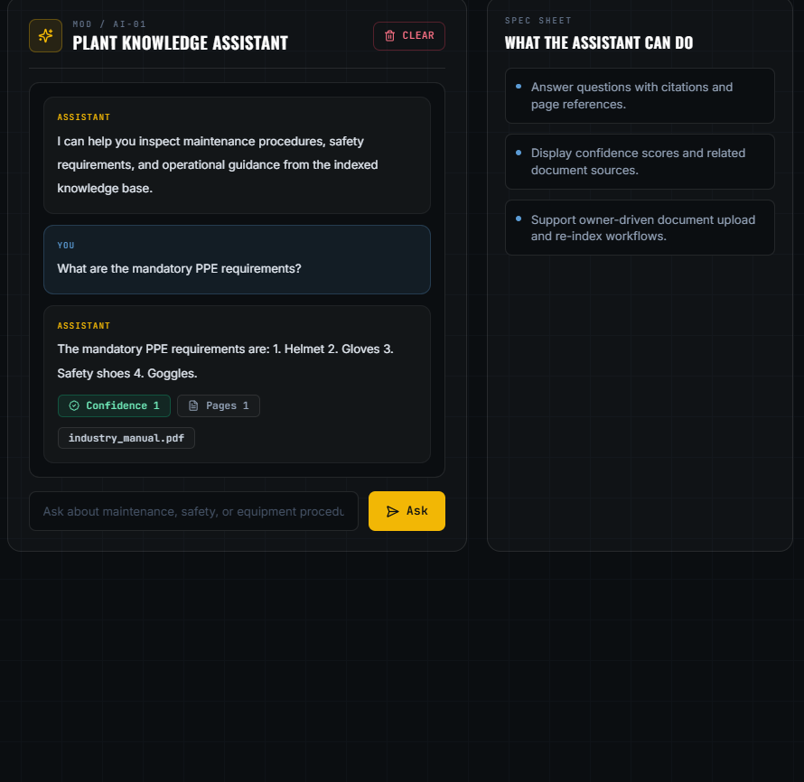
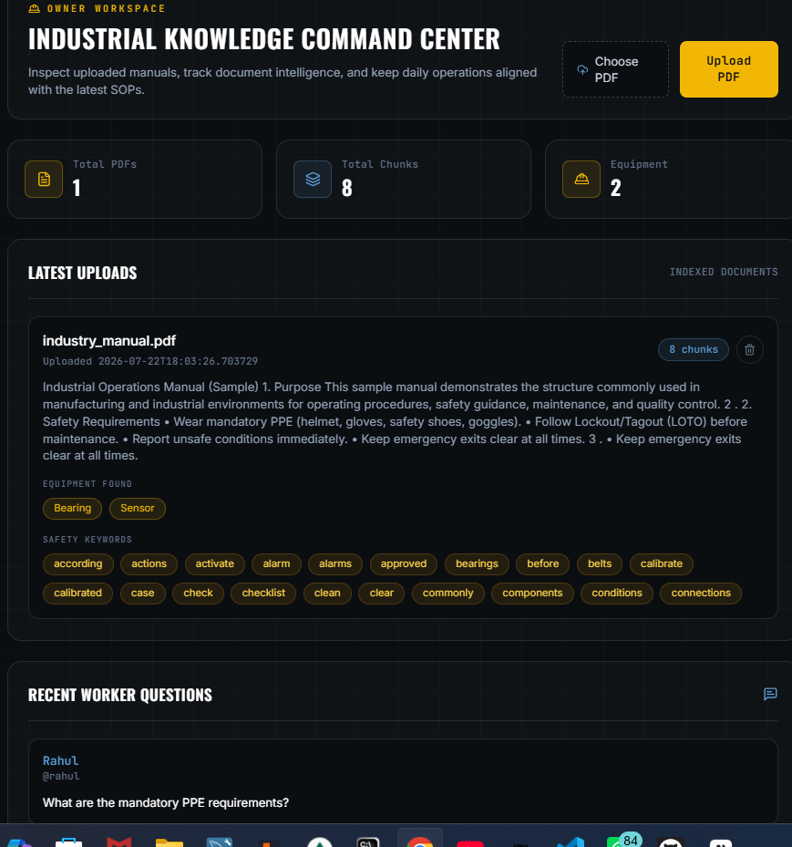

<div align="center">



# 🏭 Industrial Knowledge Intelligence Platform (IKIP)

### Turn Industrial PDFs into an Intelligent, Searchable Knowledge Base — Powered by RAG & LLMs

<p>
An AI-powered platform that ingests industrial manuals, SOPs, inspection reports, and maintenance documents, and delivers accurate, <b>citation-backed answers</b> using Retrieval-Augmented Generation (RAG).
</p>

<!-- BADGES -->
<p>
  
  
  
  
</p>
<p>
  
  
  
  
  
</p>
<p>
  
  
  
</p>

<!-- CTA BUTTONS -->
<p>
  <a href="https://ikipeth.netlify.app/">
    
  </a>
  <a href="https://github.com/alok-kumar0421/industrial-knowledge-intelligence-platform">
    
  </a>
</p>

</div>

<br/>

## 📚 Table of Contents

- [🔍 Project Overview](#-project-overview)
- [✨ Key Features](#-key-features)
- [💡 Why IKIP?](#-why-ikip)
- [🖼️ Screenshots](#️-screenshots)
- [🎬 Demo](#-demo)
- [🏗️ System Architecture](#️-system-architecture)
- [🔄 RAG Pipeline Workflow](#-rag-pipeline-workflow)
- [🧰 Tech Stack](#-tech-stack)
- [📁 Folder Structure](#-folder-structure)
- [⚙️ Installation Guide](#️-installation-guide)
- [🔐 Environment Variables](#-environment-variables)
- [🖥️ Running the Frontend](#️-running-the-frontend)
- [🛠️ Running the Backend](#️-running-the-backend)
- [📡 API Overview](#-api-overview)
- [🔁 Project Workflow](#-project-workflow)
- [🗄️ Database Design](#️-database-design)
- [🔒 Authentication Flow](#-authentication-flow)
- [🚀 Future Scope](#-future-scope)
- [📊 Performance Highlights](#-performance-highlights)
- [🧩 Project Structure Diagram](#-project-structure-diagram)
- [🤝 Contributing](#-contributing)
- [📄 License](#-license)
- [👨‍💻 Author](#-author)
- [📬 Contact](#-contact)
- [🙏 Acknowledgements](#-acknowledgements)

---

## 🔍 Project Overview

> **Industrial Knowledge Intelligence Platform (IKIP)** is an end-to-end, production-grade RAG (Retrieval-Augmented Generation) system built to help industrial teams instantly find answers buried inside dense technical documentation.

Industrial organizations sit on mountains of unstructured knowledge — equipment manuals, standard operating procedures (SOPs), inspection reports, and maintenance logs. Finding a single answer often means manually searching through hundreds of PDF pages.

**IKIP solves this** by allowing users to:

1. 📤 Upload industrial PDF documents
2. 🧠 Automatically chunk, embed, and index them into a vector database
3. 💬 Ask natural language questions
4. ✅ Receive accurate, **citation-based answers** sourced directly from the original documents

Built with a modern full-stack architecture — **React + FastAPI + Qdrant + Groq LLM** — IKIP is designed to be fast, secure, scalable, and easy to self-host.

---

## ✨ Key Features

| Feature | Description |
|---|---|
| 🔐 **JWT Authentication** | Secure token-based authentication for all users |
| 👥 **Role-Based Access** | Separate permissions for **Owner** and **Worker** roles |
| 📄 **PDF Upload** | Upload industrial manuals, SOPs, and reports directly |
| 🔎 **OCR Processing** | Extracts text from scanned/image-based PDFs |
| ✂️ **Intelligent Chunking** | Context-aware document splitting for better retrieval |
| 🧬 **FastEmbed Embeddings** | Lightweight, high-speed vector embedding generation |
| 📌 **Qdrant Semantic Search** | Fast, accurate vector similarity search |
| 🤖 **Groq LLM Integration** | Ultra-low-latency inference for real-time responses |
| 🔗 **RAG Pipeline** | Combines retrieval + generation for grounded answers |
| 📝 **Citation-Based Answers** | Every answer references its source document |
| 📊 **Dashboard** | Centralized view of documents, usage, and activity |
| 🗃️ **Document Management** | Upload, view, organize, and delete documents |
| 📈 **Analytics** | Insights into queries, usage patterns, and document health |
| ☁️ **Cloud Deployment** | Fully deployed on Netlify (frontend) + Render (backend) |

---

## 💡 Why IKIP?

<table>
<tr>
<td width="50%" valign="top">

### 🚫 The Problem
- Industrial documentation is **scattered and unstructured**
- Manual PDF search is **slow and error-prone**
- Critical safety/maintenance info gets **overlooked**
- No easy way to **audit where an answer came from**

</td>
<td width="50%" valign="top">

### ✅ The IKIP Solution
- Centralized, searchable **knowledge base**
- **AI-powered semantic search**, not just keyword match
- **Citation-backed answers** for full traceability
- Role-based access for **owners vs. workers**

</td>
</tr>
</table>

> [!TIP]
> IKIP is ideal for manufacturing plants, maintenance teams, quality assurance departments, and any organization drowning in technical PDF documentation.

---

## 🖼️ Screenshots

<div align="center">

### 📊 Dashboard


### 💬 AI Chat Interface


### 📤 Document Upload


</div>

---

## 🎬 Demo

<div align="center">


**🔗 Live Demo:** [https://ikipeth.netlify.app/](https://ikipeth.netlify.app/)

</div>

---

## 🏗️ System Architecture

```
                         ┌───────────────────────────────────────────┐
                         │              CLIENT (Browser)              │
                         │      React + Vite + Tailwind CSS UI        │
                         └───────────────────┬─────────────────────────┘
                                             │  HTTPS / REST API
                                             ▼
                         ┌───────────────────────────────────────────┐
                         │              FASTAPI BACKEND                │
                         │  ┌─────────────┐   ┌────────────────────┐  │
                         │  │  Auth (JWT) │   │  Role-Based Access  │  │
                         │  └─────────────┘   └────────────────────┘  │
                         │  ┌─────────────┐   ┌────────────────────┐  │
                         │  │ Upload API  │   │   Query / Chat API  │  │
                         │  └──────┬──────┘   └──────────┬──────────┘  │
                         └─────────┼──────────────────────┼────────────┘
                                   │                      │
                       ┌───────────▼───────────┐   ┌──────▼─────────────┐
                       │   Document Processor   │   │    RAG Pipeline     │
                       │ PyMuPDF + OCR + Chunk  │   │ Retrieval + Groq LLM │
                       └───────────┬───────────┘   └──────┬─────────────┘
                                   │                      │
                       ┌───────────▼───────────┐   ┌──────▼─────────────┐
                       │   FastEmbed Embeddings  │  │   Qdrant Vector DB   │
                       └───────────┬───────────┘   └──────────┬──────────┘
                                   │                          │
                                   └────────────┬─────────────┘
                                                ▼
                                   ┌────────────────────────┐
                                   │   Neon PostgreSQL DB    │
                                   │ Users, Docs, Metadata   │
                                   └────────────────────────┘
```

---

## 🔄 RAG Pipeline Workflow

```
 ┌──────────────┐     ┌───────────────┐     ┌────────────────┐     ┌───────────────┐
 │  PDF Upload   │ ──▶ │ Text/OCR      │ ──▶ │ Chunking        │ ──▶ │ Embedding      │
 │ (Manuals/SOPs)│     │ Extraction    │     │ (Semantic Split)│     │ (FastEmbed)    │
 └──────────────┘     └───────────────┘     └────────────────┘     └───────┬───────┘
                                                                            │
                                                                            ▼
 ┌──────────────┐     ┌───────────────┐     ┌────────────────┐     ┌───────────────┐
 │ Cited Answer  │ ◀── │ Groq LLM      │ ◀── │ Context Builder │ ◀── │ Qdrant Vector  │
 │ to User       │     │ Generation    │     │ (Top-K Chunks)  │     │ Similarity Srch│
 └──────────────┘     └───────────────┘     └────────────────┘     └───────────────┘
```

**Pipeline Steps:**

1. **Ingestion** – PDF is uploaded and parsed using `PyMuPDF` (with OCR fallback for scanned docs)
2. **Chunking** – Text is split into semantically meaningful chunks with overlap
3. **Embedding** – Each chunk is converted into a vector using `FastEmbed`
4. **Indexing** – Vectors are stored in `Qdrant` with document metadata
5. **Retrieval** – On query, top-K relevant chunks are fetched via semantic search
6. **Generation** – `Groq LLM` generates a grounded answer using retrieved context
7. **Citation** – Response includes references to the exact source document/section

---

## 🧰 Tech Stack

<div align="center">

| Layer | Technologies |
|---|---|
| **Frontend** |    |
| **Backend** |   |
| **AI / RAG** |  FastEmbed · Qdrant · PyMuPDF |
| **Database** |  |
| **Auth** | JWT Authentication · Role-Based Access (Owner/Worker) |
| **Deployment** |   |

</div>

---

## 📁 Folder Structure

```
industrial-knowledge-intelligence-platform/
│
├── frontend/                          # React + Vite Frontend
│   ├── public/
│   ├── src/
│   │   ├── assets/
│   │   ├── components/
│   │   │   ├── auth/
│   │   │   ├── dashboard/
│   │   │   ├── chat/
│   │   │   └── upload/
│   │   ├── context/
│   │   ├── hooks/
│   │   ├── pages/
│   │   ├── services/                  # API service layer
│   │   ├── utils/
│   │   ├── App.jsx
│   │   └── main.jsx
│   ├── index.html
│   ├── tailwind.config.js
│   ├── vite.config.js
│   └── package.json
│
├── backend/                            # FastAPI Backend
│   ├── app/
│   │   ├── api/
│   │   │   ├── auth.py
│   │   │   ├── documents.py
│   │   │   ├── query.py
│   │   │   └── analytics.py
│   │   ├── core/
│   │   │   ├── config.py
│   │   │   ├── security.py
│   │   │   └── dependencies.py
│   │   ├── models/                     # SQLAlchemy / Pydantic models
│   │   ├── services/
│   │   │   ├── pdf_processor.py
│   │   │   ├── embedding_service.py
│   │   │   ├── vector_store.py
│   │   │   └── rag_pipeline.py
│   │   ├── db/
│   │   │   └── database.py
│   │   └── main.py
│   ├── requirements.txt
│   └── .env.example
│
├── assets/                              # README media assets
│   ├── banner.png
│   ├── dashboard.png
│   ├── chat.png
│   ├── upload.png
│   └── demo.gif
│
├── docs/                                 # Additional documentation
├── .gitignore
├── LICENSE
└── README.md
```

---

## ⚙️ Installation Guide

### ✅ Prerequisites

Make sure you have the following installed before proceeding:

| Requirement | Minimum Version |
|---|---|
| Node.js | v18.x or higher |
| npm / yarn | Latest stable |
| Python | 3.10+ |
| pip | Latest |
| PostgreSQL (Neon) | Cloud instance or local |
| Qdrant | Cloud instance or Docker |
| Groq API Key | [console.groq.com](https://console.groq.com) |

### 📥 Clone the Repository

```bash
git clone https://github.com/alok-kumar0421/industrial-knowledge-intelligence-platform.git
cd industrial-knowledge-intelligence-platform
```

---

## 🔐 Environment Variables

Create a `.env` file inside the **backend/** directory using the template below:

```env
# ------------------------------
# 🔑 App Configuration
# ------------------------------
APP_ENV=development
APP_PORT=8000

# ------------------------------
# 🗄️ Database (Neon PostgreSQL)
# ------------------------------
DATABASE_URL=postgresql://<user>:<password>@<neon-host>/<dbname>?sslmode=require

# ------------------------------
# 🔐 JWT Authentication
# ------------------------------
JWT_SECRET_KEY=your_super_secret_key
JWT_ALGORITHM=HS256
ACCESS_TOKEN_EXPIRE_MINUTES=60

# ------------------------------
# 🧠 AI / LLM Configuration
# ------------------------------
GROQ_API_KEY=your_groq_api_key
GROQ_MODEL=llama-3.3-70b-versatile

# ------------------------------
# 📌 Qdrant Vector Database
# ------------------------------
QDRANT_URL=https://your-qdrant-instance-url
QDRANT_API_KEY=your_qdrant_api_key
QDRANT_COLLECTION_NAME=ikip_documents

# ------------------------------
# 📄 File Upload
# ------------------------------
MAX_UPLOAD_SIZE_MB=25
UPLOAD_DIR=./uploads

# ------------------------------
# 🌐 CORS
# ------------------------------
FRONTEND_URL=http://localhost:5173
```

> [!IMPORTANT]
> Never commit your actual `.env` file. Always use `.env.example` as a reference and keep secrets out of version control.

---

## 🖥️ Running the Frontend

```bash
# Navigate to frontend directory
cd frontend

# Install dependencies
npm install

# Start development server
npm run dev

# Build for production
npm run build

# Preview production build
npm run preview
```

The frontend will be available at **`http://localhost:5173`**

---

## 🛠️ Running the Backend

```bash
# Navigate to backend directory
cd backend

# Create virtual environment
python -m venv venv

# Activate virtual environment
# Windows:
venv\Scripts\activate
# macOS/Linux:
source venv/bin/activate

# Install dependencies
pip install -r requirements.txt

# Run database migrations (if applicable)
alembic upgrade head

# Start the FastAPI server
uvicorn app.main:app --reload --port 8000
```

The backend API will be available at **`http://localhost:8000`**
Interactive API docs (Swagger) at **`http://localhost:8000/docs`**

---

## 📡 API Overview

<details>
<summary><strong>🔐 Authentication Endpoints</strong></summary>

| Method | Endpoint | Description | Access |
|---|---|---|---|
| `POST` | `/api/auth/register` | Register a new user | Public |
| `POST` | `/api/auth/login` | Login and receive JWT token | Public |
| `GET` | `/api/auth/me` | Get current logged-in user | Authenticated |

</details>

<details>
<summary><strong>📄 Document Endpoints</strong></summary>

| Method | Endpoint | Description | Access |
|---|---|---|---|
| `POST` | `/api/documents/upload` | Upload a new PDF document | Owner |
| `GET` | `/api/documents` | List all uploaded documents | Owner/Worker |
| `GET` | `/api/documents/{id}` | Get document details | Owner/Worker |
| `DELETE` | `/api/documents/{id}` | Delete a document | Owner |

</details>

<details>
<summary><strong>💬 Query / RAG Endpoints</strong></summary>

| Method | Endpoint | Description | Access |
|---|---|---|---|
| `POST` | `/api/query/ask` | Ask a question, get a cited answer | Owner/Worker |
| `GET` | `/api/query/history` | Get past query history | Owner/Worker |

</details>

<details>
<summary><strong>📊 Analytics Endpoints</strong></summary>

| Method | Endpoint | Description | Access |
|---|---|---|---|
| `GET` | `/api/analytics/overview` | Platform usage overview | Owner |
| `GET` | `/api/analytics/documents` | Per-document analytics | Owner |

</details>

---

## 🔁 Project Workflow

```
   ┌────────────┐    ┌────────────┐    ┌─────────────┐    ┌────────────┐
   │  Register   │───▶│    Login    │───▶│  Upload Docs │───▶│  Processing │
   │  / Login    │    │  (JWT Auth) │    │ (Owner Role) │    │ (Chunk+Embed)│
   └────────────┘    └────────────┘    └─────────────┘    └──────┬─────┘
                                                                  │
   ┌────────────┐    ┌────────────┐    ┌─────────────┐          │
   │  Cited      │◀───│  RAG        │◀───│   Ask a      │◀─────────┘
   │  Answer     │    │  Response   │    │   Question   │
   └────────────┘    └────────────┘    └─────────────┘
```

---

## 🗄️ Database Design

<div align="center">

| Table | Description | Key Fields |
|---|---|---|
| **users** | Stores user accounts & roles | `id`, `email`, `password_hash`, `role`, `created_at` |
| **documents** | Metadata for uploaded PDFs | `id`, `owner_id`, `filename`, `status`, `uploaded_at` |
| **document_chunks** | Chunk-level metadata (linked to Qdrant vectors) | `id`, `document_id`, `chunk_text`, `vector_id`, `page_number` |
| **queries** | Log of user queries & responses | `id`, `user_id`, `question`, `answer`, `sources`, `created_at` |
| **analytics** | Aggregated usage metrics | `id`, `metric_type`, `value`, `recorded_at` |

</div>

**Entity Relationship (Simplified):**

```
 users (1) ───< (many) documents ───< (many) document_chunks
   │
   └───< (many) queries
```

---

## 🔒 Authentication Flow

```
┌──────────┐        ┌──────────────┐        ┌──────────────┐        ┌───────────────┐
│  Client   │──────▶ │ POST /login   │──────▶ │ Verify creds  │──────▶ │ Generate JWT   │
│ (Login UI)│        │  credentials  │        │ (bcrypt hash) │        │ (signed token) │
└──────────┘        └──────────────┘        └──────────────┘        └───────┬───────┘
                                                                              │
┌──────────┐        ┌──────────────┐        ┌──────────────┐               │
│ Protected  │◀───── │ Role Check    │◀───── │ Verify JWT    │◀──────────────┘
│  Resource  │        │ (Owner/Worker)│        │ (middleware)  │
└──────────┘        └──────────────┘        └──────────────┘
```

- Passwords are hashed using **bcrypt** before storage
- JWT tokens are signed with a secret key and have a configurable expiry
- Role claims (**Owner** / **Worker**) are embedded in the token payload
- Middleware validates tokens and enforces role-based route protection

---

## 🚀 Future Scope

- [ ] Multi-language document support
- [ ] Voice-based query interface
- [ ] Advanced analytics dashboard with usage heatmaps
- [ ] Support for Excel/Word/CAD document ingestion
- [ ] Real-time collaborative annotation on documents
- [ ] On-premise deployment option for air-gapped industrial networks
- [ ] Fine-tuned domain-specific LLM for industrial terminology
- [ ] Mobile application (iOS/Android)
- [ ] Integration with IoT sensor data for predictive maintenance insights

---

## 📊 Performance Highlights

| Metric | Result |
|---|---|
| ⚡ Query Response Time | ~1–3 seconds (Groq LLM inference) |
| 📄 PDF Processing Speed | ~2–5 seconds per page (with OCR fallback) |
| 🔍 Semantic Search Latency | < 100ms (Qdrant vector search) |
| 🎯 Retrieval Accuracy | High precision via top-K semantic re-ranking |
| ☁️ Uptime | 99%+ (Netlify + Render cloud infrastructure) |
| 📦 Scalability | Horizontally scalable backend via FastAPI + async I/O |

---

## 🧩 Project Structure Diagram

```
                     ┌───────────────────────────┐
                     │        IKIP Platform        │
                     └─────────────┬─────────────┘
             ┌─────────────────────┼─────────────────────┐
             ▼                     ▼                     ▼
     ┌───────────────┐     ┌───────────────┐     ┌───────────────┐
     │   Frontend     │     │    Backend     │     │  AI / RAG Core │
     │ React + Vite   │     │ FastAPI + Auth │     │ Groq + Qdrant  │
     │ + Tailwind CSS │     │ + REST APIs    │     │ + FastEmbed    │
     └───────────────┘     └───────────────┘     └───────────────┘
             │                     │                     │
             └─────────────────────┼─────────────────────┘
                                   ▼
                     ┌───────────────────────────┐
                     │   Neon PostgreSQL Storage   │
                     └───────────────────────────┘
```

---

## 🤝 Contributing

Contributions are what make the open-source community such an amazing place to learn, inspire, and create. Any contributions you make are **greatly appreciated**.

1. **Fork** the repository
2. **Create** your feature branch
   ```bash
   git checkout -b feature/AmazingFeature
   ```
3. **Commit** your changes
   ```bash
   git commit -m "Add: AmazingFeature"
   ```
4. **Push** to the branch
   ```bash
   git push origin feature/AmazingFeature
   ```
5. **Open** a Pull Request

> [!NOTE]
> Please make sure to update tests as appropriate and follow the existing code style before submitting a PR.

---

## 📄 License

This project is licensed under the **MIT License**.
See the [LICENSE](LICENSE) file for full details.

```
MIT License © 2026 Alok Kumar
Permission is granted, free of charge, to use, copy, modify, and distribute this software.
```

---

## 👨‍💻 Author

<div align="center">

### **Alok Kumar**
*Full-Stack Developer · AI/RAG Systems Engineer*

[](https://github.com/alok-kumar0421)

</div>

---

## 📬 Contact

<div align="center">

| Platform | Link |
|---|---|
| 🐙 GitHub | [github.com/alok-kumar0421](https://github.com/alok-kumar0421) |
| 🌐 Live Project | [ikipeth.netlify.app](https://ikipeth.netlify.app/) |
| 📂 Repository | [industrial-knowledge-intelligence-platform](https://github.com/alok-kumar0421/industrial-knowledge-intelligence-platform) |

</div>

---

## 🙏 Acknowledgements

- [Groq](https://groq.com/) — for blazing-fast LLM inference
- [Qdrant](https://qdrant.tech/) — for high-performance vector search
- [FastEmbed](https://github.com/qdrant/fastembed) — for lightweight embeddings
- [FastAPI](https://fastapi.tiangolo.com/) — for a modern, high-performance backend framework
- [React](https://react.dev/) & [Vite](https://vitejs.dev/) — for a fast, modern frontend experience
- [Neon](https://neon.tech/) — for serverless PostgreSQL
- [Netlify](https://www.netlify.com/) & [Render](https://render.com/) — for seamless deployment

---

<div align="center">

### ⭐ If you found this project useful, consider giving it a star!


**Built with ❤️ for Industrial Intelligence**

</div>